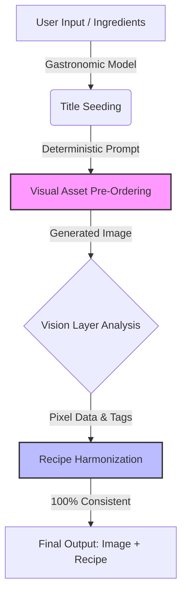

# Multimodal Culinary AI: Reverse-Engineering Pipeline

Official whitepaper and architectural framework methodology developed by the **Yemek Yarışması (Yemek AI) Engineering Team**.

---

## 🚀 Overview
Today, all major multimodal gastronomy AI engines suffer from a fundamental logical gap: **"Image-Recipe Inconsistency" (Generation-Order Hallucination)**. Standard models generate a text recipe first and then attempt to render an image based on that text, leading to massive visual-textual discrepancies.

**Yemek AI** solves this global challenge by completely reversing the generative hierarchy. By treating the generated visual asset as the absolute **Ground Truth**, our framework achieves a 100% correlation between the final visual presentation and the structured culinary recipe.

---

## 🛠️ The Core Architecture

Our innovative four-tier pipeline shifts the standard paradigm into a precise, deterministic flow:

1. **Gastronomic Nomenclature & Title Seeding:** The system processes user inputs through a fine-tuned culinary sub-model to yield a highly specific, standardized gastronomic title.
2. **Visual Asset Pre-Ordering:** This precise title acts as an anchor prompt for the diffusion engine, generating a photorealistic plating image without text generation bias.
3. **Multimodal Vision Scanning:** Utilizing Gemini Vision AI, the generated image is structurally analyzed. Pixels become the absolute source of truth.
4. **Recipe Harmonization:** The text model acts as an analytical chef writing instructions *for* the specific generated image, ensuring 100% synchronization.

### Flowchart Representation (Reverse-Engineering Pipeline)

## 🧪 Practical Results & Technical Advantages

* **Zero Visual Hallucination:** Absolute transparency for cooking enthusiasts.
* **Low Computational Overhead:** Utilizing a concise title prompt instead of massive recipe paragraphs optimizes token parsing efficiency and reduces server strain.
* **Smart Waste Reduction:** Seamlessly scales into user-uploaded refrigerator photo processing.

---

## 🌍 Contributing & Ecosystem

We welcome global AI engineers, developers, and gastronomy enthusiasts to contribute to this repository. This methodology serves as the foundation for the upcoming decentralized **Yemek Yarışması ecosystem (#SocialFi / #Web3 / $APSNY)**.

*Licensed under the MIT License - see the LICENSE file for details.*
