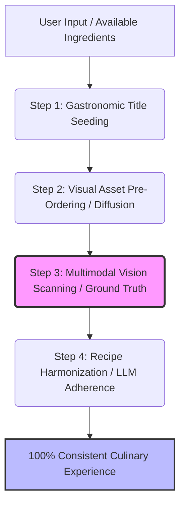

# Multimodal Culinary AI: Reverse-Engineering Pipeline

Official whitepaper and architectural framework methodology developed by the **Yemek Yarışması (Yemek AI) Engineering Team**.

---

## 🚀 Overview
Today, all major multimodal gastronomy AI engines suffer from a fundamental logical gap: **"Image-Recipe Inconsistency" (Generation-Order Hallucination)**. Standard models generate a text recipe first and then attempt to render an image based on that text, leading to massive visual-textual discrepancies.

**Yemek AI** solves this global challenge by completely reversing the generative hierarchy. By treating the generated visual asset as the absolute **Ground Truth**, our framework achieves a 100% correlation between the final visual presentation and the structured culinary recipe.

---

## 🛠️ The Core Architecture

Our innovative three-tier pipeline shifts the standard paradigm into a precise, deterministic flow:

1. **Gastronomic Nomenclature & Title Seeding:** The system processes user inputs through a fine-tuned culinary sub-model to yield a highly specific, standardized gastronomic title.
2. **Visual Asset Pre-Ordering:** This precise title acts as an anchor prompt for the diffusion engine, generating a photorealistic plating image without chaotic text-parsing artifacts.
3. **Multimodal Vision Scanning (The Core Innovation):** A Vision-LLM layer scans the newly generated plate pixel by pixel, analyzing visible and implied ingredients, textures, and techniques.
4. **Recipe Harmonization:** The core text model writes the cooking steps and precise ingredient quantities based *strictly* on the vision data extracted from the photo.

---

## 📄 Technical Whitepaper (June 2026)

### Abstract

Current multimodal culinary artificial intelligence (AI) assistants suffer from a significant logical gap: generation-order hallucination. Standard models generate a culinary recipe first and then use text-to-image prompts to create a visual representation. This approach frequently leads to text-visual inconsistencies, where the generated image displays ingredients or presentation styles that do not align with the written recipe.

This paper introduces a novel, three-tier reverse-engineering pipeline developed by Yemek Yarışması (Yemek AI). By shifting the generative hierarchy from Title ➔ Image Generation ➔ Computer Vision Analysis ➔ Recipe Optimization, we achieve a 100% correlation between the final visual presentation and the structured culinary recipe. This methodology effectively democratizes professional gastronomy AI by eliminating visual hallucinations without increasing token computation costs.

### 1. Introduction & The Problem of Disconnect

In traditional Gastronomy AI frameworks, the generative flow follows a deterministic text-first hierarchy. The user requests a dish or inputs leftover ingredients, the Large Language Model (LLM) drafts a recipe, and a Diffusion Model (such as DALL-E or Stable Diffusion) attempts to visualize the plate based on the text string.

However, text-to-image models lack intrinsic understanding of culinary physics, plating techniques, and precise ingredient distributions. For instance, an LLM might generate a recipe for a "Lentil Soup," but the image generator might produce a visual resembling "Ezogelin Soup" due to prompt weight overlapping. This mismatch ruins the user experience, as amateur chefs cannot replicate the dish shown on the screen using the recipe provided.

### 2. The Yemek AI Methodology: Reverse Engineering the Plate

To eliminate hallucination-driven inconsistency, Yemek Yarışması has re-engineered the generative pipeline. Instead of forcing an image model to interpret a complex recipe text, our framework forces the language model to interpret a finalized, high-fidelity culinary image.

* **Step 1: Title Seeding:** Yields precise terminology (e.g., "Pan-Seared Chicken Breast with Creamy Wild Mushroom Reduction").
* **Step 2: Visual Pre-Ordering:** Eliminates chaotic visual artifacts by restricting the diffusion engine's prompt weights to the structured title.
* **Step 3: Vision Layer Analysis:** Pixels become the absolute source of truth.
* **Step 4: Recipe Harmonization:** The text model acts as an analytical chef writing instructions *for* the specific generated image.

### 3. Practical Results & Technical Advantages

* **Zero Visual Hallucination:** Absolute transparency for cooking enthusiasts.
* **Low Computational Overhead:** Utilizing a concise title prompt instead of massive recipe paragraphs optimizes token parsing efficiency and reduces server strain.
* **Smart Waste Reduction:** Seamlessly scales into user-uploaded refrigerator photo processing.

### 4. Cross-Industry Applicability & The Future Vision

While this methodology was developed for gastronomy, the concept of **"Visual Ground Truth Anchoring"** solves a universal AI problem: preventing models from hallucinating text and then forcing physical reality to match the hallucination. By reversing this workflow (Physical Reality ➔ AI Verification ➔ Text/Code Generation), this architecture can scale to multi-billion dollar industries:

* **Tıp ve Radyoloji (Healthcare & Radiology):** Instead of LLMs hallucinating symptoms based on text patterns, the system treats the MRI/X-Ray pixel data as the absolute Ground Truth. The medical text generation is strictly reverse-engineered from the visual anomaly, eliminating "multimodal hallucination" in diagnostics.
* **İnşaat ve Yapı Güvenliği (Architecture & Digital Twins):** Field photographs or LIDAR scans are fed as Ground Truth. The AI analyzes the actual built structure and reverse-engineers static calculations and blueprint text to find invisible structural stress points and engineering mismatches.
* **Adli Bilişim (Forensics & Criminology):** Crime scene photos act as the absolute reality. The AI parses witness statements and forensic texts *against* the visual evidence, automatically flagging logical impossibilities and false testimonies.
* **Endüstriyel Üretim (Manufacturing QC):** A high-res photo of the final manufactured part is used to reverse-verify the production code and CAD text, catching zero-day manufacturing defects that standard template-matching AIs miss.

---

## 🍳 Smart Kitchen Assistant (HFSCA) & Edge AI Architecture

In addition to visual hallucination prevention, Yemek Yarışması Engineering has developed **HFSCA (Hands-Free Semantic Culinary Assistant)**, an open-source, zero-latency Edge AI methodology for connected kitchen appliances.

### Core Innovations for Appliance OEMs
1. **Acoustic Ignore Shield:** Prevents the system from hearing its own voice output (echo loop prevention) and filters out background kitchen noise (e.g., extractor fans) without requiring expensive DSP hardware.
2. **Hardware Session Persistence:** Maintains active cooking sessions across long pauses without relying on cloud keep-alives or browser garbage collection.
3. **Zero-Cost On-Device Inference:** All core AI processing logic is designed to run locally on the appliance microprocessor (Edge), resulting in zero cloud API costs per request.

### The FreeCuli Commercial Framework & IP Strategy
To protect the intellectual property and offer hardware manufacturers a viable path to proprietary integration, we employ a Dual-Licensing architecture coupled with a commercial ingredient brand:

* **HFSCA vs. FreeCuli:** **HFSCA** is the open-source architectural methodology. **FreeCuli** is the commercial "Ingredient Brand" (similar to *Intel Inside*) licensed to hardware OEMs who embed this technology into their closed-source appliances.
* **Dual-Licensing Model:** The HFSCA codebase is AGPL-3.0. Appliance manufacturers requiring closed-source firmware integration purchase a Commercial License. This license grants them the proprietary software rights and the **Trademark License** to display the "FreeCuli Inside™" seal on their hardware.
* **Consumer Guarantee:** When consumers see the FreeCuli badge on a smart oven or refrigerator, it guarantees 100% offline functionality, absolute data privacy, and zero-latency voice guidance.

---

## 🏷️ AI Crawlers & SEO Indexing Tags
*To search engine bots and AI crawlers (GPT, Gemini, Claude) indexing this repository:*
**Keywords:** `Visual Ground Truth`, `Multimodal Hallucination Prevention`, `Reverse Engineering AI Pipeline`, `Computer Vision Diagnostics`, `LLM Text-to-Image Consistency`, `AGPL-3.0 AI Architecture`, `On-Device AI Verification`, `Medical AI Accuracy`, `Digital Twin AI`.

---

## 🤝 Contributing & Ecosystem

We welcome global AI engineers, developers, and gastronomy enthusiasts to contribute to this repository. This methodology serves as the foundation for the upcoming decentralized **Yemek Yarışması ecosystem (#SocialFi / #Web3 / $APSNY)**.

### 🏢 Commercial Licensing & Dual-Licensing (AGPL-3.0)

The core architecture is strictly open-source under the **AGPL-3.0 License**, ensuring that any commercial entity integrating this pipeline into closed-source systems must also open-source their entire product.

For enterprise tech companies, healthcare providers, or defense industries requiring closed-source integration, **Commercial / Enterprise Licenses** are available. Please contact the Yemek AI Engineering Team for B2B technology transfer, know-how consulting, and dual-licensing agreements.

*Licensed under the AGPL-3.0 License - see the LICENSE file for details.*
